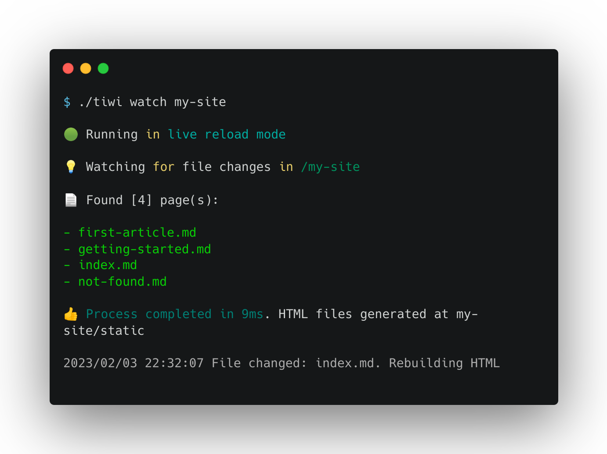

<div align="center">

<h2>Build Websites With Markdown
</h2>



</div>


## Installation

Clone repository

```bash
git clone https://github.com/EdwinWalela/tiwi
```

Compile tiwi

```bash
make
```

Run tiwi

```bash
./tiwi


tiwi parses and builds html sites from markdown

Usage:
  tiwi [command]

Available Commands:
  build       Generates HTML files
  create      Initializes the tiwi project
  help        Help about any command

Flags:
  -h, --help   help for tiwi

Use "tiwi [command] --help" for more information about a command.

```

## Usage

```bash
$ ./tiwi create
```

The `create` command takes in an argument of the project name.

```bash

Please specify the project name:

tiwi create <my-project>

For example:

tiwi create my-tiwi-site

```

### Create a project

```bash
./tiwi create my-site
```

To be able to use the `tiwi` command inside the project, copy the binary into the project

```bash
cp tiwi my-site
```

The `create` command scaffolds the project with an `index.md` and `not-found.md`

### Generate HTML

```bash
./tiwi build
```

This commands generates a folder called `static` containing the HTML files

```bash
$ ./tiwi build

Found [2] page(s):

- index.md
- not-found.md

Generating HTML...

Process complete. HTML files generated at /static.
```
<div align="center">

</div>
