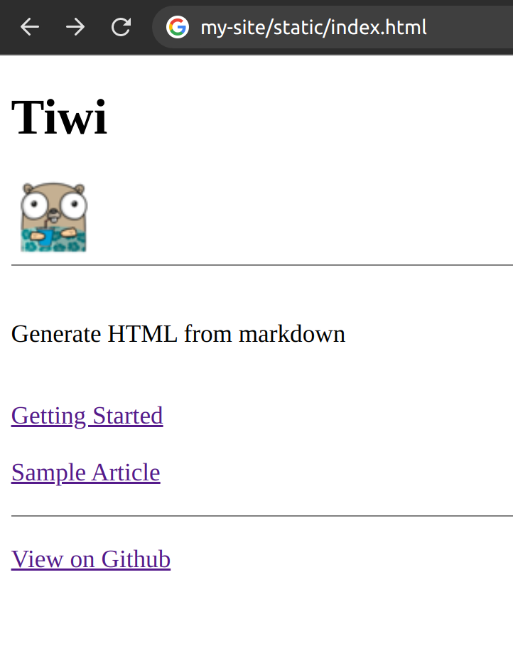

<div align="center">


</div>

<div align="center">
<h2>Supports Live Reload</h2>

</div>

 [](https://opensource.org/licenses/MIT) [](https://goreportcard.com/report/github.com/edwinwalela/tiwi)  [](https://pkg.go.dev/github.com/edwinwalela/tiwi) 

## Installation

Clone repository

```bash
git clone https://github.com/EdwinWalela/tiwi
```

Run tests and compile tiwi

```bash
cd tiwi && make
```

Run tiwi

```bash
./tiwi


tiwi parses and builds html sites from markdown

Usage:
  tiwi [command]

Available Commands:
  build       Generates HTML files
  create      Initializes the tiwi project
  help        Help about any command

Flags:
  -h, --help   help for tiwi

Use "tiwi [command] --help" for more information about a command.

```

## Usage

```bash
$ ./tiwi create
```

The `create` command takes in an argument of the project name.

```bash

Please specify the project name:

tiwi create <my-project>

For example:

tiwi create my-tiwi-site

```

### Create a project

```bash
./tiwi create my-site
```

The `create` command scaffolds the project with the following default markdown files:
- index.md  
- not-found.md
- first-article.md
- getting started.md

### Generate HTML

```bash
./tiwi build -w <project-name>
```

This commands generates a folder called `static` containing the HTML files

The `build` command takes in an optional flag `-w` which converts empty lines to `<br/>` tags

```bash
$ ./tiwi build my-site

Found [4] page(s):

- first-article.md
- getting-started.md
- index.md
- not-found.md

Generating HTML...

Process complete. HTML files generated at mysite/static.
```

### Generated static website

<div align="center">

</div>

---

## Contributing

Any contribution, in the form of a suggestion, bug report or pull request, is well accepted. 

Here is a [list of good issues to get started](https://github.com/EdwinWalela/tiwi/contribute)